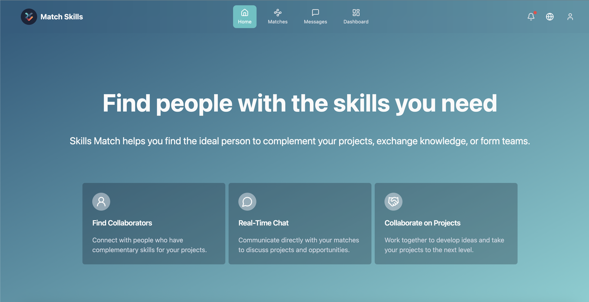
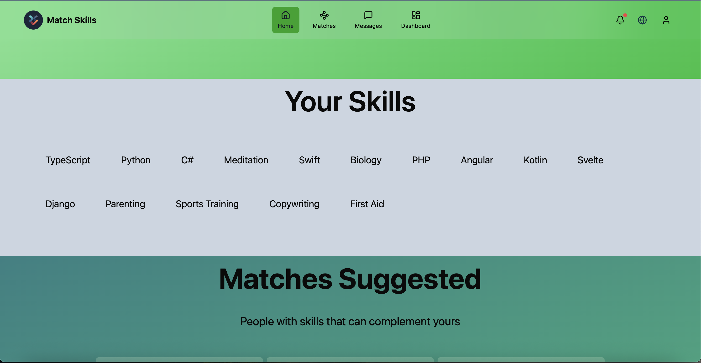
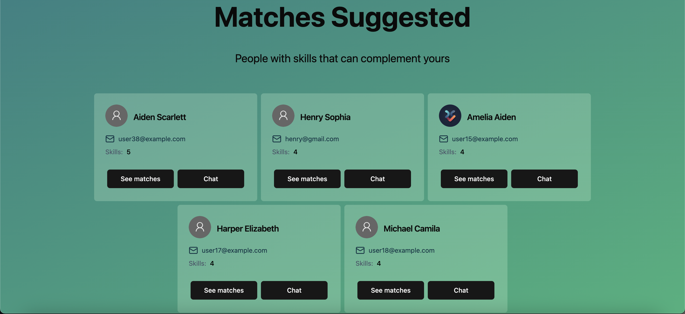
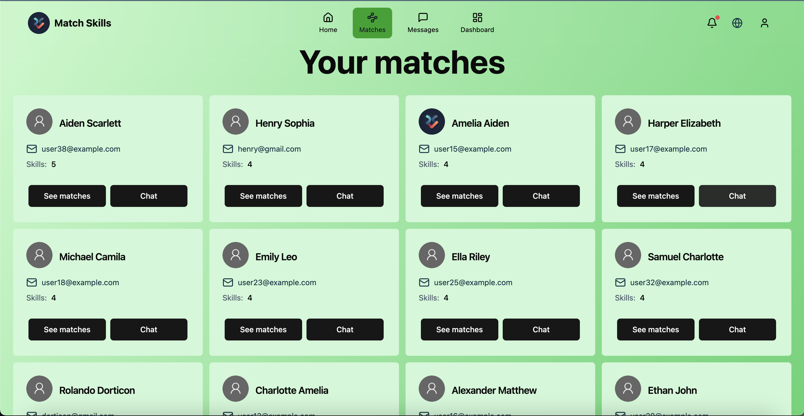
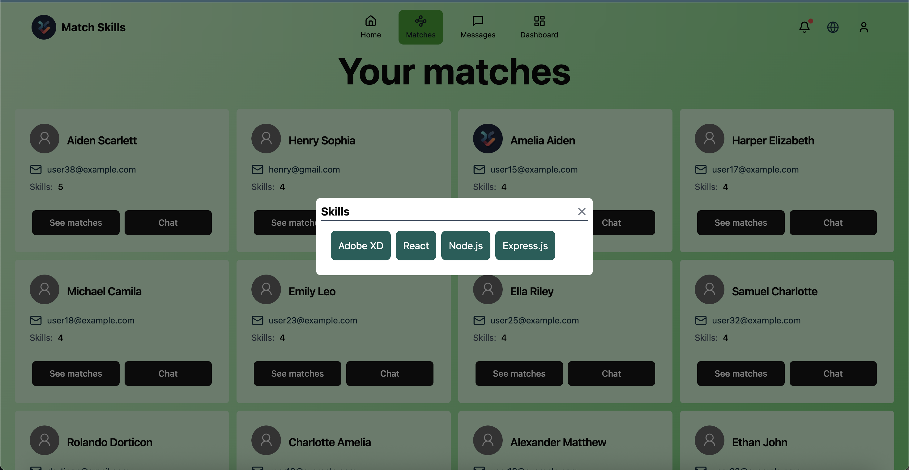
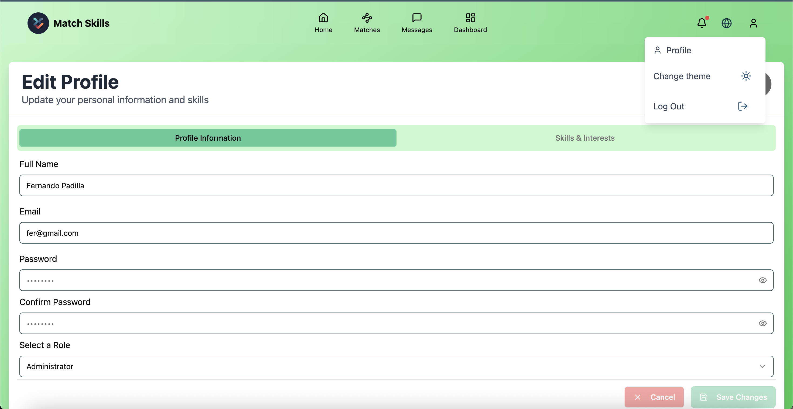
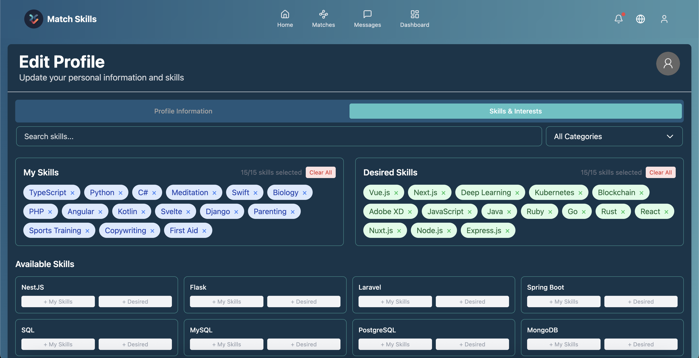
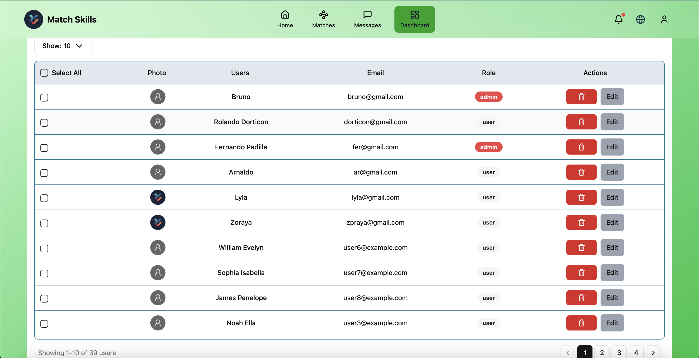
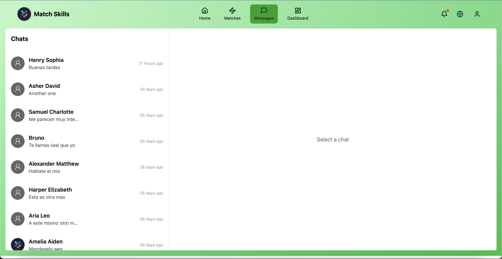
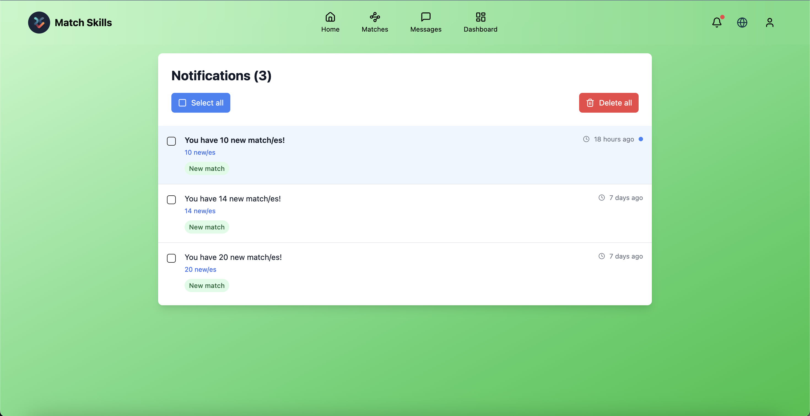

# Skills Match

_A system that connects people with complementary skills for projects and collaborations._

---

## Table of Contents

1. [Features](#features)
2. [Tech Stack](#tech-stack)
3. [Project Structure](#project-structure)
4. [Installation](#installation)
   - [Prerequisites](#prerequisites)
   - [Backend Setup](#backend-setup)
   - [Frontend Setup](#frontend-setup)
5. [Environment Variables](#environment-variables)
6. [Usage](#usage)
   - [Running Backend](#running-backend)
   - [Running Frontend](#running-frontend)
7. [API Endpoints](#api-endpoints)
8. [Screenshots](#screenshots)
9. [Contributing](#contributing)
10. [License](#license)

---

## Features

- 🔍 **User Authentication** with JWT and session management
- 🤝 **Skill Matching**: Match users by complementary skills
- 💬 **Real-time Chat** (via Socket.io)
- 🛠️ **User & Notification Management**
- 🏗️ **Admin Dashboard** to manage users and matches
- 🔔 **Notifications** for new matches and messages
- 🌐 **i18n Support** (English & Spanish)
- 🎨 **Light/Dark Mode**

---

## Tech Stack

- **Frontend**: React, Vite, TypeScript, Axios, React Router, Tailwind CSS, Shadcn/ui, i18next, Framer Motion, Lucide
- **Backend**: Node.js, Express, MongoDB, Mongoose, JWT, Bcrypt, Cors, Dotenv, Morgan, Lodash, express-async-errors, Nodemon
- **Testing**: Jest, Supertest

---

## Project Structure

```
match-habilidades/
├── backend/                 # Express API
│   ├── controllers/         # Route handlers
│   ├── middleware/          # Auth, error handling, etc.
│   ├── models/              # Mongoose schemas
│   ├── services/            # Business logic (user, match, notification)
│   ├── tests/               # Jest & Supertest tests
│   ├── app.js               # Express app setup
│   └── server.js            # Server entrypoint
├── frontend/                # React application
│   ├── src/
│   │   ├── components/      # UI components and toast setup
│   │   ├── hooks/           # Custom hooks (useAuth, useNotifications)
│   │   ├── pages/           # Route pages (Login, Dashboard, Profile)
│   │   ├── services/        # Axios API wrappers
│   │   ├── stores/          # Zustand or Context stores
│   │   ├── locales/         # i18n translation files
│   │   ├── types/           # TypeScript type definitions
│   │   ├── utils/           # Utility functions
│   │   ├── App.tsx          # Root component
│   │   └── main.tsx         # Entry point
│   └── vite.config.ts       # Vite configuration
├── certificate/             # Self-signed SSL certs for local HTTPS
├── screenshots/             # UI screenshots
├── .env.example             # Example environment variables
├── .gitignore
└── README.md                # This file
```

---

## Installation

### Prerequisites

- Node.js v16+
- npm or yarn
- MongoDB (local or Atlas)

### Backend Setup

1. **Install dependencies**
   ```bash
   cd backend
   npm install
   # or yarn
   ```
2. **Configure environment**
   - Copy `.env.example` to `.env` and fill in values (see [Environment Variables](#environment-variables)).
3. **Run the server**
   ```bash
   npm run dev
   # or yarn dev
   ```

### Frontend Setup

1. **Install dependencies**
   ```bash
   cd frontend
   npm install
   # or yarn
   ```
2. **Configure environment**
   - Copy `.env.example` to `.env` and set `VITE_API_URL` to your backend URL (e.g., `https://localhost:3000`).
3. **Run the app**
   ```bash
   npm run dev
   # or yarn dev
   ```

---

## Environment Variables

Copy the `.env.example` files in both `backend/` and `frontend/` and fill the following:

```bash
# backend/.env
PORT=3001
MONGODB_URI=your_mongodb_connection_string
TEST_MONGODB_URI=your_mongodb_connection_string

SECRET = for you jwt put a string here

FRONTEND_URL=https://localhost:5173
BACKEND_URL=https://localhost:3001
COOKIE_DOMAIN=localhost 

#Save photos
CLOUDINARY_CLOUD_NAME= your cloudinary name
CLOUDINARY_API_KEY=your cloudinary api_key
CLOUDINARY_API_SECRET=your cloudinary api_key
DEFAULT_AVATAR_URL= this is for a default picture for user

```

---

## Usage

### Running Backend

```bash
cd backend
npm run dev
```

The API runs on `https://localhost:3000` (or the `PORT` you set).

### Running Frontend

```bash
cd frontend
npm run dev
```

The React app runs on `http://localhost:5173` by default.

---

## API Endpoints

### Auth

- `POST /api/auth/register` – Register new user
- `POST /api/auth/login` – Login and get JWT
- `POST /api/auth/logout` – Invalidate session

### Users

- `GET /api/users` – List users (admin)
- `GET /api/users/:id` – Get user profile
- `PATCH /api/users/:id` – Update user
- `DELETE /api/users/:id` – Delete user

### Matches

- `GET /api/matches` – Get your matches
- `POST /api/matches` – Create/update matches manually

### Notifications

- `GET /api/notifications` – List notifications
- `PATCH /api/notifications/:id` – Mark as read
- `DELETE /api/notifications/:id` – Delete one
- `DELETE /api/notifications/bulk` – Bulk delete

### Chat

- WebSocket `/socket.io` – Real-time messaging endpoints

---

## Screenshots














---

## Contributing

Contributions are welcome! Follow these steps:

1. Fork the repo
2. Create a branch: `git checkout -b feature/my-feature`
3. Commit your changes: `git commit -m 'Add some feature'`
4. Push to the branch: `git push origin feature/my-feature`
5. Open a Pull Request

Please read `CONTRIBUTING.md` (if present) for contribution guidelines.

---

## License

This project is licensed under the MIT License. See the [LICENSE](./LICENSE) file for details.

