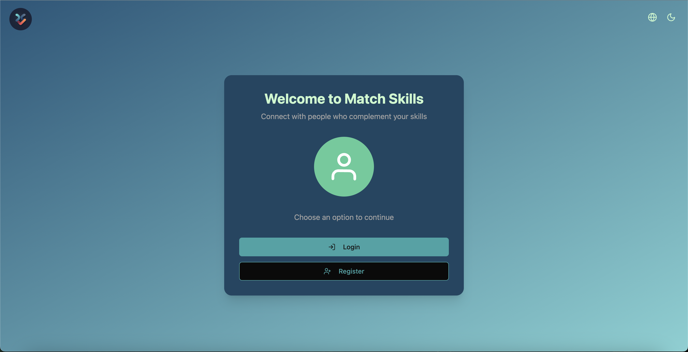
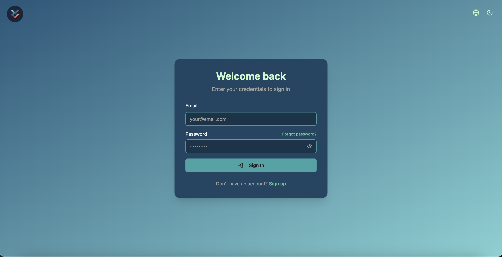
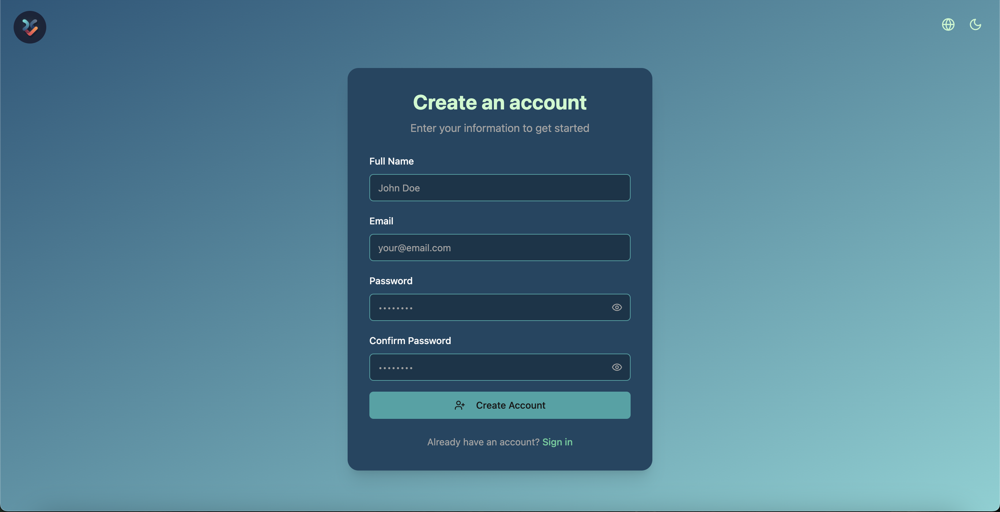

# Match de Habilidades

Un sistema que conecta personas con habilidades complementarias para proyectos y colaboraciones.

## Capturas de Pantalla




## Tecnologías Utilizadas
- **Frontend:** React, Vite, Axios, React Router, Tailwind CSS, Shadcn/ui,i18next,Framer Motion, Lucide
- **Backend:** Express, MongoDB, Mongoose, JWT, Bcrypt , Cors, Dotenv, Morgan. Lodash, express-async-errors, Nodemon, Supertest

## Instalación
1. Clona el repositorio:
   ```sh
   git clone https://github.com/brunomanuel00/MatchSkills.git
   cd MatchSkills
   rm -rf .git

2. Instalar dependencias
   cd frontend && pnpm install
   cd ../backend && npm install
3. Configurar env
   backend/.env
   MONGODB_URI=mongodb+srv://TUCUENTAMONGODB@cluster0.54z7f.mongodb.net/NombreRegistro?retryWrites=true&w=majority&appName=Cluster0
   PORT=3001

   TEST_MONGODB_URI=mongodb+srv://TUCUENTAMONGODB@cluster0.54z7f.mongodb.net/TestNombreRegistro?retryWrites=true&w=majority

SECRET = para el jwt;

4. Inicia el servidor
   cd backend && npm dev

5. Inicia el frontend
   cd ../frontend && pnpm dev

## Estructura del Proyecto
/frontend
  ├── public/
  ├── src/
  │   ├── assets/
  │   ├── components/
  │       ├── ui/
  │   ├── lib/
  │   ├── locales/
  │       ├── en/
  │       ├── es/
  │   ├── pages/
  │       ├── auth/
  │   ├── routes/
  │   ├── services/
  │   ├── styles/
  │   ├── types/
  ├── components.json
  ├── eslint.config.js
  ├── index.html
  ├── package.json
  ├── pnpm-lock.yaml
  ├── postcss.config.js
  ├── tailwind.config.js
  ├── tsconfig.app.json
  ├── tsconfig.json
  ├── tsconfig.node.json
  ├── vite.config.ts
/backend
  ├── src/
  │   ├── controllers/
  │   ├── models/
  │   ├── request/
  │   ├── utils/
  ├── .env
  ├── .eslintrc.js
  ├── app.js
  ├── .eslint.config.mjs
  ├── index.js
  ├── package-lock.json
  ├── package.json

## Funcionalidades
✅ Registro y autenticación con JWT  
✅ Búsqueda de habilidades  
✅ Sistema de match basado en compatibilidad  
✅ Chat en tiempo real (próximamente)

## Contribuir
¡Las contribuciones son bienvenidas!  
1. Haz un fork del proyecto  
2. Crea una rama: `git checkout -b mi-nueva-funcionalidad`  
3. Haz tus cambios y crea un PR  

## Licencia
Este proyecto está bajo la licencia MIT.