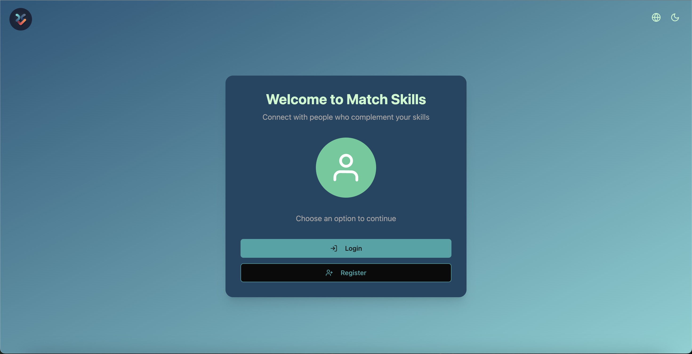
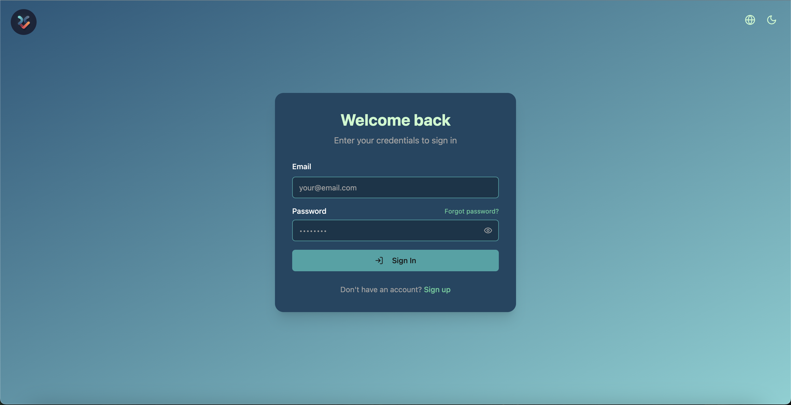
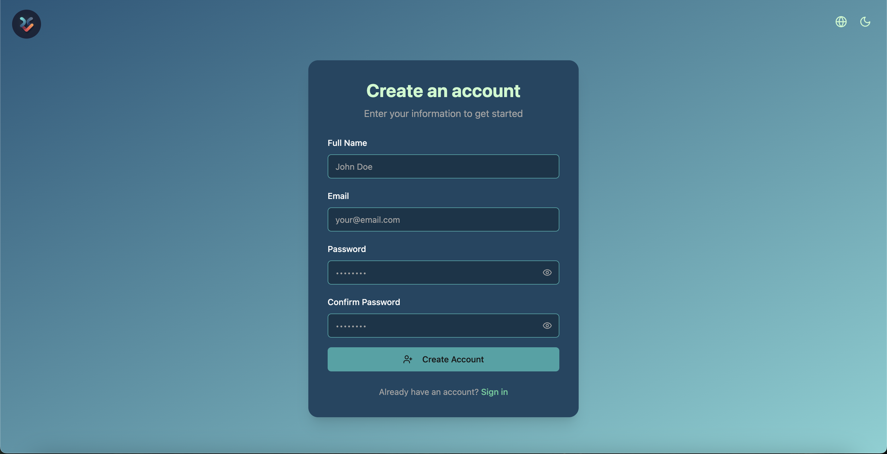

# Skills Match

A system that connects people with complementary skills for projects and collaborations.

## Screenshots





## Technologies Used

* **Frontend:** React, Vite, TypeScript, Axios, React Router, Tailwind CSS, Shadcn/ui, i18next, Framer Motion, Lucide
* **Backend:** Express, MongoDB, Mongoose, JWT, Bcrypt, Cors, Dotenv, Morgan, Lodash, express-async-errors, Nodemon, Supertest

## 🔒 Local HTTPS with Self-Signed Certificates

This project uses local HTTPS so that `Secure` cookies work correctly (required by Safari).

### 🧪 Generate Certificates

Use the following script:

```sh
./generate-cert.sh
```

## Installation

1. Clone the repository:

   ```sh
   git clone https://github.com/brunomanuel00/MatchSkills.git
   cd MatchSkills
   rm -rf .git
   ```

2. Install dependencies:

   ```sh
   cd frontend && pnpm install
   cd ../backend && npm install
   ```

3. Configure environment variables in `backend/.env`:

   ```sh
   MONGODB_URI=<Your MongoDB connection string>
   PORT=3001

   TEST_MONGODB_URI=<Your Test MongoDB connection string>

   SECRET=<Your JWT secret>
   ```

4. Start the backend server:

   ```sh
   cd backend && npm run dev
   ```

5. Start the frontend development server:

   ```sh
   cd ../frontend && pnpm dev
   ```

## Project Structure

```sh
├── README.md
├── backend/
│   ├── app.js
│   ├── cert/
│   │   └── key.pem
│   ├── client.js
│   ├── controllers/
│   │   ├── auth.js
│   │   ├── cloudinary.js
│   │   ├── match.js
│   │   ├── message.js
│   │   └── user.js
│   ├── eslint.config.mjs
│   ├── index.js
│   ├── models/
│   │   ├── Match.js
│   │   ├── Message.js
│   │   ├── Notification.js
│   │   └── User.js
│   ├── package.json
│   ├── request/
│   │   ├── Test_patch.rest
│   │   ├── create_new_user.rest
│   │   ├── login.rest
│   │   └── logout.rest
│   ├── service/
│   │   └── aiMatches.js
│   ├── temp_uploads/
│   ├── test-bcrypt.js
│   └── utils/
│       ├── cloudinary.js
│       ├── config.js
│       ├── logger.js
│       └── middleware.js
|       └──utils.js
└── frontend/
    ├── components.json
    ├── eslint.config.js
    ├── index.html
    ├── package.json
    ├── pnpm-lock.yaml
    ├── postcss.config.js
    ├── public/
    ├── src/
    │   ├── assets/
    │   ├── components/
    │   │   └── ui/
    │   ├── lib/
    │   ├── locales/
    │   │   ├── en/
    │   │   └── es/
    │   ├── pages/
    │   │   └── auth/
    │   ├── routes/
    │   ├── services/
    │   ├── styles/
    │   └── types/
    ├── tailwind.config.js
    ├── tsconfig.app.json
    ├── tsconfig.json
    ├── tsconfig.node.json
    └── vite.config.ts
```

## Features

* ✅ User registration and authentication with JWT
* ✅ Skill search
* ✅ Matching system based on compatibility
* ✅ Real-time chat (coming soon)

## Contributing

Contributions are welcome!

1. Fork the repository.
2. Create a new branch: `git checkout -b my-new-feature`.
3. Make your changes and open a Pull Request.

## License

This project is licensed under the MIT License.
